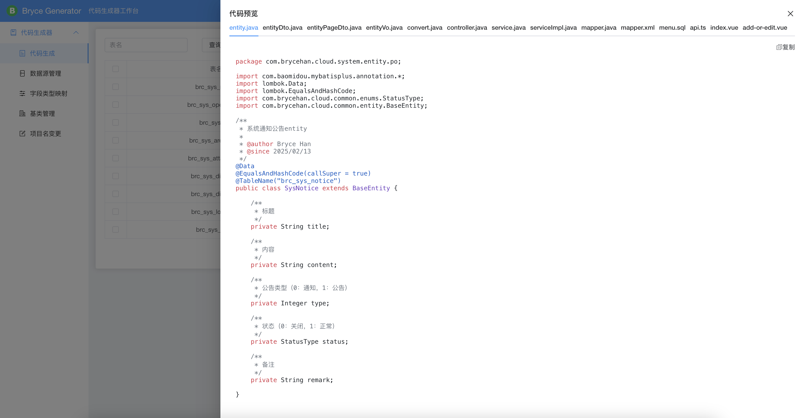

## Bryce Generator

本项目是一款代码生成器，可根据自定义模板内容，快速生成代码，可实现项目的快速开发、上线，减少重复的代码编写，开发人员只需专注业务逻辑即可。

* 前端工程：[https://github.com/brycehan/bryce-admin](https://github.com/brycehan/bryce-admin)
* 开发平台后端工程（单体版）：[https://github.com/brycehan/bryce-boot](https://github.com/brycehan/bryce-boot)
* 开发平台后端工程（微服务）：[https://github.com/brycehan/bryce-cloud](https://github.com/brycehan/bryce-cloud)
* 超好用的代码生成器：[https://github.com/brycehan/bryce-generator](https://github.com/brycehan/bryce-generator)

## 平台简介

布莱斯是一套全部开源的快速开发平台，毫无保留给个人及企业免费使用。

* 采用前后端分离的模式，前端技术栈（[Vue3](https://v3.cn.vuejs.org) [Element Plus](https://element-plus.org/zh-CN) [Vite](https://cn.vitejs.dev)）。
* 后端采用Spring Boot、Spring Cloud & Alibaba，分为单体版和微服务两个版本。。
* 权限认证使用Jwt，支持多终端认证系统。
* 支持加载动态权限菜单，多方式轻松权限控制。
* 高效率开发，使用代码生成器可以一键生成前后端代码。
* 单体后端版本，请移步[bryce-boot](https://github.com/brycehan/bryce-boot)，微服务版本，请移步[bryce-cloud](https://github.com/brycehan/bryce-cloud)。

## 系统模块

~~~
bryce-generator
├── bryce-generator-boot-starter    // boot启动器
├── bryce-generator-core            // 核心模块
├── bryce-generator-server          // 服务模块 [8100]
├── bryce-generator-ui              // 前端项目
├── db                              // 数据库脚本
│       └── dm8.sql                         // 达梦数据库
│       └── mysql.sql                       // MySQL数据库
│       └── oracle.sql                      // Oracle数据库
│       └── postgresql.sql                  // PG数据库
│       └── sqlserver.sql                   // SQLServer数据库
├── docker                          // 容器模块
├── images                          // 图片
├── pom.xml                          // 公共依赖
~~~

## 内置功能

1.  代码生成：先导入数据库表，然后生成代码。
2.  数据源管理：配置新的数据源，用于代码生成的表的来源。
3.  字段类型映射：配置数据库字段类型和Java属性的映射。
4.  基类管理：配置实体类的基类相关信息。
5.  项目名变更：用于快速修改项目名和包名等。

## 演示图

|  |    |
|--------------------------------------|----------------------------------------|
|  |  |
|      |        |
